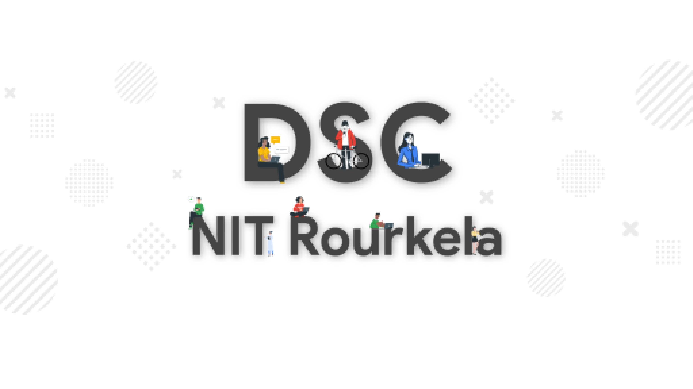

<!-- ALL-CONTRIBUTORS-BADGE:START - Do not remove or modify this section -->

<!-- ALL-CONTRIBUTORS-BADGE:END -->

# About App

- The project repository of the mobile application for the Institute Counselling Services, NIT Rourkela. We are using the [Flutter](https://flutter.dev/) framework for the development of the application. This application has more than 3000 active users and is the most popular application at National Institute of Technology Rourkela.

## DSC NIT Rourkela

Project developed and maintained by [DSC NIT Rourkela](https://dscnitrourkela.org/)

## Installation Guide

1. **Install Flutter on your machine**

    Install flutter by selecting the operating system on which you are installing Flutter: [Flutter installation tutorial](https://flutter.dev/docs/get-started/install)

    To check if you have flutter installed along wtih proper necesarry SDKs installed
    run `flutter doctor`

2. **Fork and Clone the Repo**

    Fork the repo by clicking on the **Fork** button on the top right corner of the page.
    To clone this repository, run `git clone https://github.com/dscnitrourkela/project-avocado.git`
    Then run `cd project-avocado`

3. **Get Packages**

     Make sure you are in the `project-avocado/scp` directory

    - From the terminal: Run `flutter pub get`.
      _OR_
    - From Android Studio/IntelliJ: **Click Packages get** in the action ribbon at the top of `pubspec.yaml`.
    - From VS Code: **Click Get Packages** located in right side of the action ribbon at the top of `pubspec.yaml`.

    After the above steps, you should see the following message in the terminal:

### Run the App

  On terminal:

- Check that an Android device is running by running `flutter devices`. If none are shown, follow the device-specific instructions on the [Install](https://flutter.dev/docs/get-started/install) page for your OS.
- Run the app with the following command: `flutter run`

Congrats 🥳 ! You just ran the _Project Avocado_.
Feel free to use the application in whatever way possible and make sure to send us feedbacks and suggest changes.

## Contributing

------------
Our Slack Community: [Slack Invite](http://bit.ly/NITRDevs)  

`Contributions are welcome 🎉🎉`

Please refer to the project's style and contribution guidelines for submitting patches and additions. In general, we follow the "fork-and-pull" Git workflow.

 1. **Fork** the repo on GitHub
 2. **Clone** the project to your own machine
 3. **Commit** changes to your own branch
 4. **Push** your work back up to your fork
 5. Submit a **Pull request** so that we can review your changes

NOTE 1: Please abide by the [Contributing Guidelines](https://github.com/dscnitrourkela/project-avocado/blob/master/CONTRIBUTING.md).

NOTE 2: Please abide by the [Code of Conduct](https://github.com/dscnitrourkela/project-avocado/blob/master/CODE_OF_CONDUCT.md).

## Starware

dscnitrourkela/project-avocado is Starware.  
This means you're free to use the project, as long as you star its GitHub repository.  
Your appreciation makes us grow and glow up. ⭐

## Preview

<pre>

      
</pre>

## Use

- Make appointments
- Timetable selector
- Manage your mentors/mentees
- Get Notifications
- Attendance Tracker
- Freshers Chat Support

## Contributors ✨

Thanks goes to these wonderful people ([emoji key](https://allcontributors.org/docs/en/emoji-key)):

<!-- ALL-CONTRIBUTORS-LIST:START - Do not remove or modify this section -->
<!-- prettier-ignore-start -->
<!-- markdownlint-disable -->
<table>
  <tr>
    <td align="center"><a href="https://designrknight-website.web.app/"> <b>Abel Mathew</b></a> <a href="https://github.com/dscnitrourkela/project-avocado/commits?author=DesignrKnight" title="Code">💻</a> <a href="#projectManagement-DesignrKnight" title="Project Management">📆</a> <a href="#maintenance-DesignrKnight" title="Maintenance">🚧</a></td>
    <td align="center"><a href="https://allcontributors.org"> <b>All Contributors</b></a> <a href="#tool-all-contributors" title="Tools">🔧</a></td>
    <td align="center"><a href="https://www.linkedin.com/in/patibanda-sriram-237a0b193/"> <b>SriramPatibanda</b></a> <a href="https://github.com/dscnitrourkela/project-avocado/commits?author=SriramPatibanda" title="Code">💻</a></td>
    <td align="center"><a href="https://github.com/nayakastha"> <b>Astha Nayak</b></a> <a href="https://github.com/dscnitrourkela/project-avocado/commits?author=nayakastha" title="Code">💻</a></td>
    <td align="center"><a href="https://github.com/Thesmader"> <b>Smarak Das</b></a> <a href="https://github.com/dscnitrourkela/project-avocado/commits?author=Thesmader" title="Code">💻</a> <a href="#projectManagement-Thesmader" title="Project Management">📆</a> <a href="#maintenance-Thesmader" title="Maintenance">🚧</a></td>
    <td align="center"><a href="https://github.com/ankank30"> <b>Ankesh Anku</b></a> <a href="https://github.com/dscnitrourkela/project-avocado/commits?author=ankank30" title="Code">💻</a> <a href="#projectManagement-ankank30" title="Project Management">📆</a></td>
    <td align="center"><a href="https://github.com/Chinmay-KB"> <b>Chinmay Kabi</b></a> <a href="https://github.com/dscnitrourkela/project-avocado/commits?author=Chinmay-KB" title="Code">💻</a> <a href="#projectManagement-Chinmay-KB" title="Project Management">📆</a> <a href="#platform-Chinmay-KB" title="Packaging/porting to new platform">📦</a></td>
  </tr>
  <tr>
    <td align="center"><a href="https://abhibhaw.team"> <b>Abhibhaw Asthana</b></a> <a href="https://github.com/dscnitrourkela/project-avocado/commits?author=abhibhaw" title="Code">💻</a> <a href="#a11y-abhibhaw" title="Accessibility">️️️️♿️</a></td>
    <td align="center"><a href="http://harshpatel.netlify.app"> <b>harsh patel</b></a> <a href="https://github.com/dscnitrourkela/project-avocado/commits?author=hkp27299" title="Documentation">📖</a> <a href="#example-hkp27299" title="Examples">💡</a></td>
    <td align="center"><a href="https://github.com/rajnis09"> <b>Rajnish Singh</b></a> <a href="https://github.com/dscnitrourkela/project-avocado/commits?author=rajnis09" title="Code">💻</a></td>
    <td align="center"><a href="https://github.com/priyanshu0405"> <b>priyanshu0405</b></a> <a href="https://github.com/dscnitrourkela/project-avocado/commits?author=priyanshu0405" title="Code">💻</a></td>
    <td align="center"><a href="https://sites.google.com/view/pratik-priyadarsan-third-year/home?authuser=0"> <b>Pratik Priyadarsan</b></a> <a href="https://github.com/dscnitrourkela/project-avocado/commits?author=pratik0197" title="Code">💻</a></td>
    <td align="center"><a href="https://github.com/Priya-81199"> <b>Priya Mishra</b></a> <a href="https://github.com/dscnitrourkela/project-avocado/commits?author=Priya-81199" title="Code">💻</a> <a href="#maintenance-Priya-81199" title="Maintenance">🚧</a></td>
    <td align="center"><a href="https://github.com/haru-02"> <b>Rahul Balaji</b></a> <a href="https://github.com/dscnitrourkela/project-avocado/commits?author=haru-02" title="Code">💻</a> <a href="#maintenance-haru-02" title="Maintenance">🚧</a></td>
  </tr>
</table>

<!-- markdownlint-restore -->
<!-- prettier-ignore-end -->

<!-- ALL-CONTRIBUTORS-LIST:END -->

This project follows the [all-contributors](https://github.com/all-contributors/all-contributors) specification. Contributions of any kind welcome!
